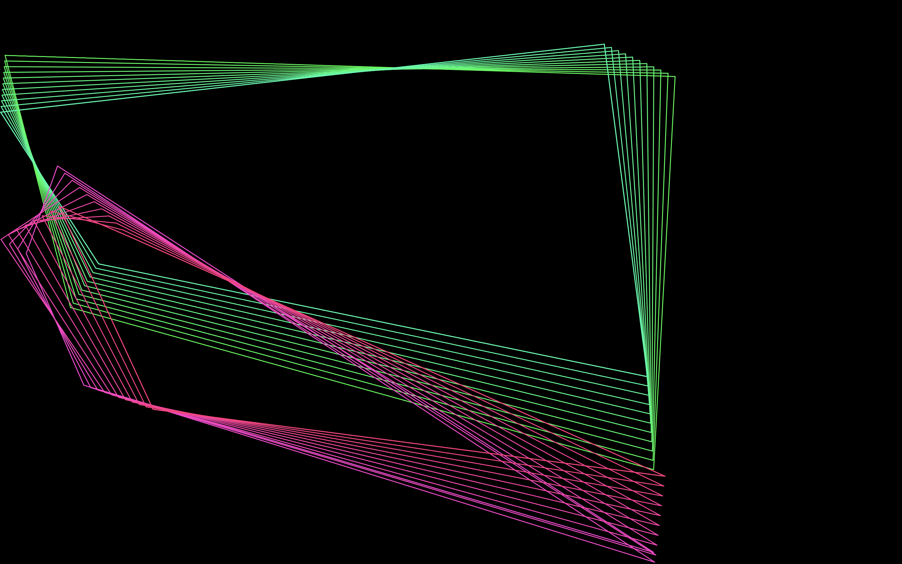

# Macstify

A macOS screen saver that recreates *Mystify Your Mind* from Windows 95: polygons drift across the
screen, bounce off the edges and leave a trail of their past outlines behind, while their colors
cycle through the spectrum.

Requires macOS 13 or later. Universal (Apple silicon and Intel).

## Options

| Option | Default | Range | |
| --- | --- | --- | --- |
| Shapes | 2 | 1–8 | Polygons on screen. |
| Vertices | 4 | 3–12 | Corners per polygon. Each corner moves on its own, which is what makes the shape churn. |
| Trail length | 12 | 1–40 | Outlines kept on screen, the live one included. |
| Speed | 1.00× | 0.2–3.0 | Vertex travel, measured against the screen's shorter edge, so the pace feels the same on any display. |
| Line width | 1.5 pt | 0.5–4.0 | |
| Color speed | 1.00× | 0.0–3.0 | Hue cycling rate. `0.00×` freezes each shape on its starting color. |

Settings are stored per user through `ScreenSaverDefaults` under `jp.winebarrel.Macstify`.
